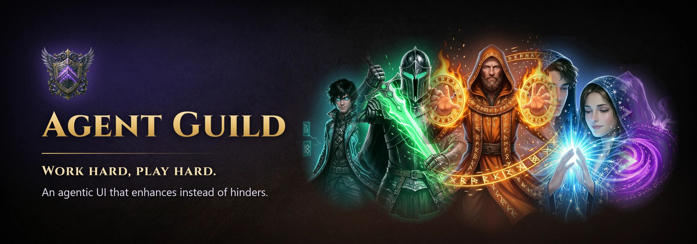
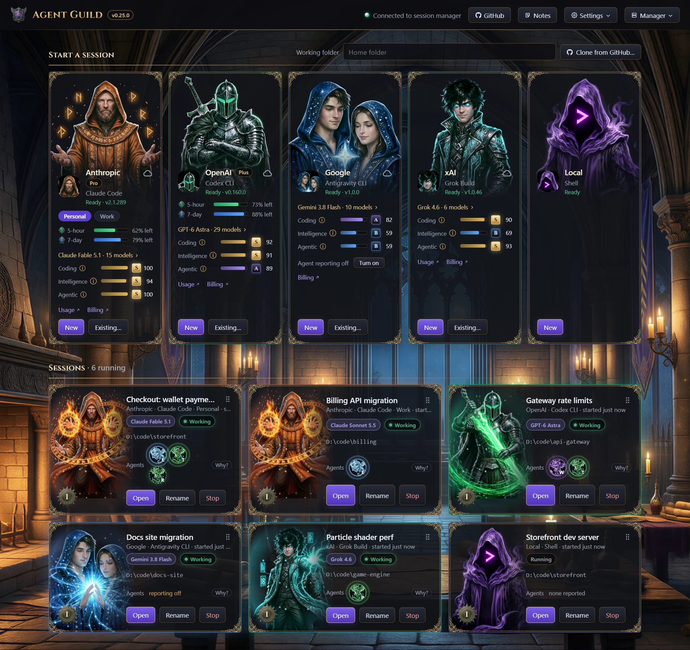
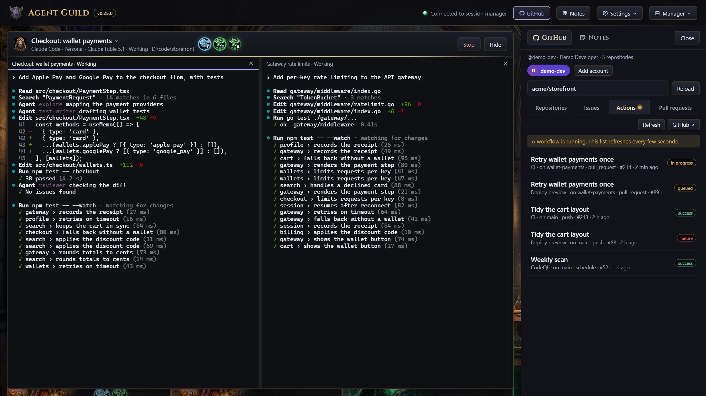

<p align="center">
  
</p>

<p align="center">
  <a href="https://www.npmjs.com/package/@oddessentials/agent-guild"></a>
  <a href="https://github.com/oddessentials/agent-guild/actions/workflows/release.yml"></a>
  
  
  <a href="LICENSE"></a>
  <a href="https://www.youtube.com/watch?v=ziT62WtXQ1M"></a>
</p>

**Agent Guild** runs Claude Code, Codex CLI, Antigravity CLI, Grok Build and
your own shell side by side, in real terminals, from one local web page.
Close the page whenever you like; the sessions keep running.

[Try the demo](https://oddessentials.github.io/agent-guild/) in your browser
(simulated, nothing installed) or [watch the trailer](https://www.youtube.com/watch?v=ziT62WtXQ1M).

<picture>
  <source media="(prefers-color-scheme: light)" srcset="docs/images/overview-light.webp">
  
</picture>

## Quick start

```sh
npm install -g @oddessentials/agent-guild
agent-guild
```

The page opens in your browser. Press **New** on a tool's card to start a
session. Sign in to each tool inside its first session, as you would in any
terminal.

| Requirement | |
| --- | --- |
| Node.js | 22 or newer |
| Windows | 10 version 1809 or later, x64 or arm64. No WSL needed. |
| macOS | 11 or later, Intel or Apple silicon |
| Linux | x64 or arm64, with a desktop or over SSH |

No compiler is needed. A missing tool shows **Install** on its card;
Antigravity CLI, which is not on npm, shows its install command instead.

## Setup

### Access token

You do not create one. The first run generates it, and `agent-guild` opens
the page with it. If a browser asks for it, open the link that
`agent-guild url` prints. Anyone with that link can use your terminals.

To replace it, stop the manager (this ends running sessions), delete
`auth-token` from the [data folder](docs/configuration.md#data-folder), and
start again.

### Headless Linux server

1. On the server:

   ```sh
   npm install -g @oddessentials/agent-guild
   agent-guild --no-browser
   ```

   It prints `Open: http://127.0.0.1:47821/#token=…`.

2. On your computer, open a tunnel and leave it open:

   ```sh
   ssh -L 47821:127.0.0.1:47821 you@server
   ```

3. Open the printed link in your browser. The local port must be `47821`;
   any other port is refused.

To start Agent Guild when the server boots, choose **Settings → Startup →
When the computer starts** in the page, then run once on the server:

```sh
sudo loginctl enable-linger $USER
```

This needs systemd and is not offered under WSL. `agent-guild status` shows
the result.

### Remote access with Tailscale

Use your terminals from a phone or another computer on your
[Tailscale](https://tailscale.com) network.

You need Tailscale 1.52 or later, signed in on both devices in the same
tailnet, with MagicDNS on.

1. In the page, choose **Settings → Remote access → Enable remote access**.
2. If it shows **Open Tailscale approval**, approve HTTPS there, then choose
   **Continue setup**.
3. If it says **Tailscale needs permission**, run the command under
   **Connection details** in a terminal allowed to manage Tailscale, then
   choose **Continue setup**.
4. Choose **Connect another device** and scan the QR code, or open the
   sign-in link, on the other device.

The sign-in link contains your access token. **Disable remote access** turns
it off; sessions keep running. On a headless server, do this through the SSH
tunnel above. For another reverse proxy, see
[configuration](docs/configuration.md#reverse-proxies).

### macOS keychain

The first Claude Code usage meter may ask for access to the
"Claude Code-credentials" keychain item. Choose **Always Allow**.

## Features

* Real terminals that survive closing or reloading the page
* Two terminals side by side with **Split**
* Install and update each tool from its card
* Helper agents and the model in use, shown on each card
  ([setup per tool](docs/agent-reporting.md))
* Rate-limit meters for Claude Code and Codex CLI
* Several accounts per tool ([accounts](docs/configuration.md#accounts))
* Model grades and benchmarks for each tool's models
* Resume a tool's earlier sessions with **Existing…**
* GitHub issues, pull requests, workflow runs, branches and cloning
* Shared notes, a news feed, six skins, light and dark mode
* tmux and herdr sessions that keep running when the manager stops



## Commands

| Command | What it does |
| --- | --- |
| `agent-guild` | Start the manager if needed and open the page. `--no-browser` prints the link instead. |
| `agent-guild status` | Show whether the manager is running and list its sessions. |
| `agent-guild stop` | Stop the manager and end every session. |
| `agent-guild restart` | Restart the manager on the installed version and end every session. |
| `agent-guild url` | Print the page link with the access token. |
| `agent-guild start` | Run the manager in the foreground. |

Sessions end when the manager stops or the computer restarts. tmux and herdr
sessions survive a manager stop.

## Privacy

The manager listens on `127.0.0.1` only. Remote access goes through a private
Tailscale route or your own reverse proxy to that address. None of these
requests carry your code or prompts:

| To | For | How often |
| --- | --- | --- |
| npm registry | Version checks | Hourly |
| Anthropic and OpenAI | Usage meters, with the tool's own sign-in | Every minute while the page is open |
| OpenRouter | Model list for benchmarks | Every 6 hours |
| News feeds, Hacker News, arXiv, GitHub | News feed | Every 30 minutes while the page is open |
| GitHub releases | What's new | Hourly, more often just after a release |
| herdr.dev, Homebrew | Multiplexer version checks | Hourly |
| GitHub, GitHub Status | GitHub panel | When you use it |
| Package sources | Installs and updates | When you ask |

Failed news, model list and release checks retry after 10 minutes.
`AGENT_GUILD_NO_UPDATE_CHECK=1` turns off version checks and self-upgrade.

## More

* [Configuration](docs/configuration.md): add tools, accounts, environment variables, reverse proxies
* [Agent reporting](docs/agent-reporting.md): show agents from any tool
* [Skins](docs/SKINS.md): make your own look
* [Contributing](CONTRIBUTING.md)

## License

[MIT](LICENSE) © Odd Essentials
