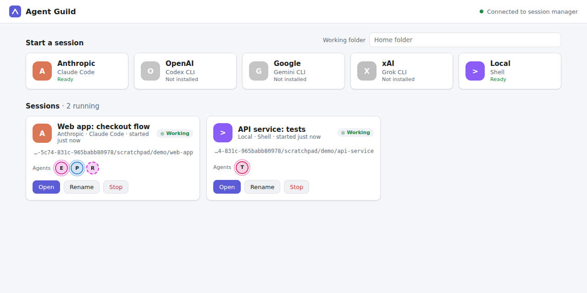

# Agent Guild

Agent Guild runs AI coding assistants side by side from one local web page.
Pick a provider, get a real interactive terminal running that provider's
coding tool, and see at a glance which sessions and agents are working.



* **Start sessions from provider icons.** Anthropic (Claude Code), OpenAI
  (Codex CLI), Google (Gemini CLI), xAI (a Grok CLI you configure), and a
  plain shell. Providers whose tool is not installed are shown greyed out
  with install instructions.
* **Work in real terminals.** Each session is a card. Open it for a full
  interactive terminal: type instructions, answer prompts, watch output. Run
  as many sessions at once as you like.
* **See agents at work.** When a coding tool reports helper agents, they
  appear as small icons on that session's card.
* **Close the page any time.** A separate local session manager owns the
  terminals. Reopen the page and it reconnects to the same sessions with
  their screens intact, as long as the manager is still running. Sessions do
  not survive a computer restart.

## Requirements

* Windows 10 1809 or later, or macOS 11 or later. Linux works for development.
* Node.js 20 or newer.
* Each coding tool you want to use, installed and signed in on its own. Agent
  Guild launches these tools; it does not install or authenticate them.

node-pty ships prebuilt binaries for Windows and macOS on x64 and arm64, so no
compiler is needed there. WSL is not required.

## Install and run

From a copy of this repository:

```sh
npm install
npm start          # same as: node bin/agent-guild.mjs open
```

Or install the commands globally:

```sh
npm install -g .
agent-guild
```

Without a terminal, double-click `launchers/AgentGuild.cmd` on Windows or
`launchers/AgentGuild.command` on macOS. The first run installs dependencies.

`agent-guild open` starts the session manager in the background if needed and
opens the page. The page URL carries an access token in its `#` fragment. The
page stores it and then removes it from the address bar.

| Command | What it does |
| --- | --- |
| `agent-guild` or `agent-guild open` | Start the manager if needed and open the page. `--no-browser` prints the URL instead. |
| `agent-guild status` | Show whether the manager is running and list its sessions. |
| `agent-guild stop` | Stop the manager. This ends every session. |
| `agent-guild start` | Run the manager in the foreground, for debugging. |
| `agent-guild url` | Print the page URL with its token. |

## Configure providers

Create `providers.json` in the data folder to change or add providers:

| Platform | Data folder |
| --- | --- |
| Windows | `%APPDATA%\AgentGuild` |
| macOS | `~/Library/Application Support/AgentGuild` |

Entries are merged with the built-in ones by `id`. A new `id` adds a
provider, and `"enabled": false` hides one. Any field can be overridden for
one platform under a `win32` or `darwin` key. See
[examples/providers.json](examples/providers.json).

| Field | Meaning |
| --- | --- |
| `id` | Lowercase identifier. |
| `vendor`, `tool` | Names shown on the icon. |
| `command`, `args` | What to run. `command` is looked up on PATH. `@shell` means the user's default shell. |
| `env` | Extra environment variables for the tool. |
| `color`, `monogram`, `icon` | Icon appearance. `icon` is a URL path; you can also drop `<id>.svg` into `web/icons/`. |
| `install`, `docs` | Help shown when the tool is not installed. |

The page's "Working folder" field sets where new sessions start. It defaults
to your home folder.

## Show agents

Agents are reported by the coding tool, not guessed from its output. For
Claude Code, add the hooks in
[examples/claude-code-settings.json](examples/claude-code-settings.json) and
each sub-agent appears on the card while it runs. Any tool or script can also
report agents with the `agent-guild-report` command or an escape sequence.
See [docs/agent-reporting.md](docs/agent-reporting.md).

## Security

* The manager listens on `127.0.0.1` only.
* Every API call needs a random per-user token, stored in the data folder
  with owner-only permissions.
* Requests with a foreign `Host` or `Origin` header are refused. This stops
  other websites from reaching the terminals through your browser.
* Tools inside a session get a separate token that can only report agents
  for that session.

Anyone who can run programs as your user can already read the token, as with
any local developer tool.

## Other front ends

The page is only one client. The manager's API is documented in
[docs/api.md](docs/api.md) so that another interface, such as a planned
Unreal Engine version where provider characters and their workers stand in
for the icons, can drive the same sessions. See
[docs/architecture.md](docs/architecture.md).

## Development

```sh
npm install
npm test
```

The tests start real managers and real pseudo-terminals, using a small fake
coding tool in `tests/fixtures`. CI runs them on Windows, macOS and Linux.

## Current limits

* There is no packaged installer yet. Users need Node.js and a copy of this
  folder. A bundled runtime with a Windows installer and a macOS app bundle
  is the next packaging step.
* Sessions end when the manager stops or the computer restarts.
* No official xAI coding CLI is configured by default. Point the `xai`
  provider at the Grok tool you use.
